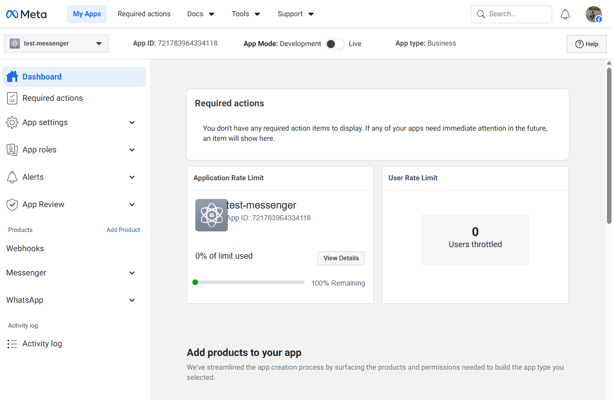
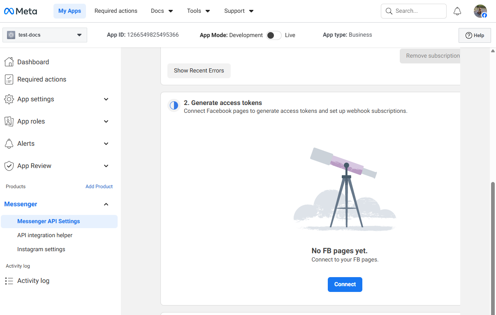
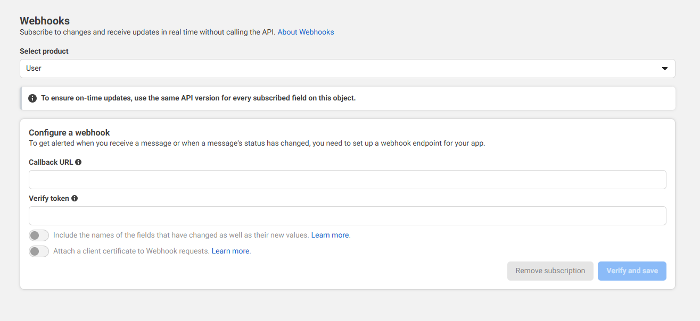
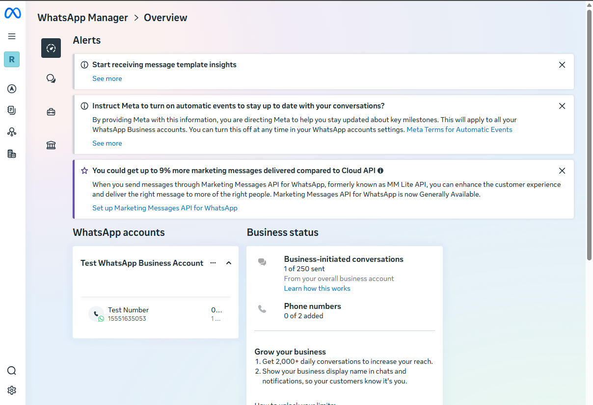
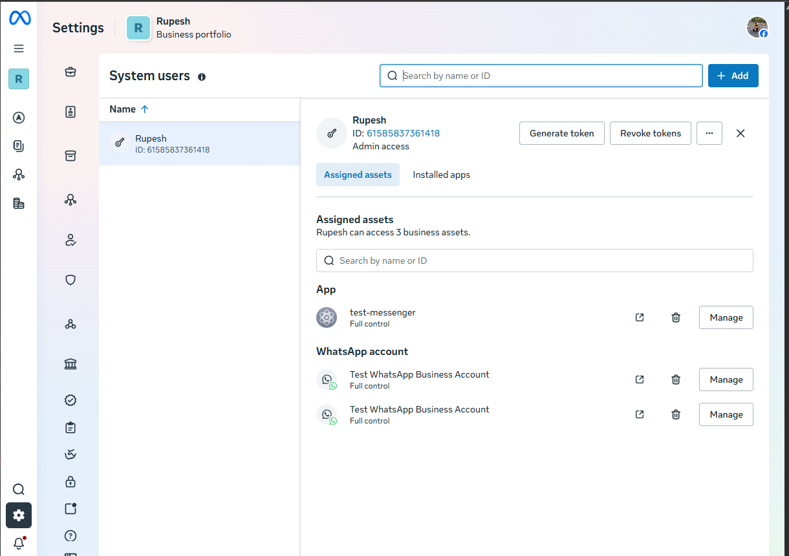
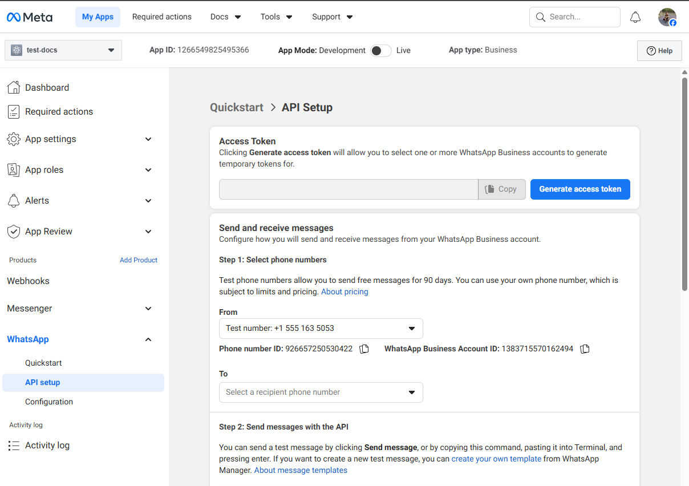
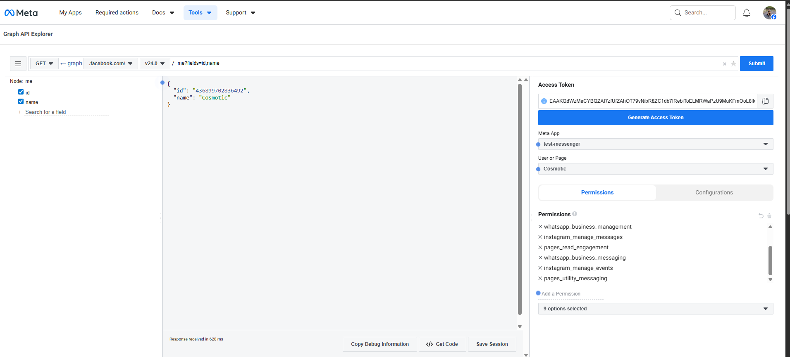

# Meta Messaging Integration (Messenger and WhatsApp)

This document explains how Messenger and WhatsApp were configured using **Meta Developers** and **Meta Business Suite**, including webhook setup, token generation, and local testing with ngrok.

## Overview

Meta integrations require **two separate dashboards** that work together:

1. **Meta Developers** – App, webhook, and product configuration  
2. **Meta Business Suite** – Business assets, permissions, system users, and tokens

Both are mandatory for Messenger and WhatsApp.

## Common Requirements

- Meta account
- Meta Business Account
- Public HTTPS URL (used via ngrok during development)
- Node.js backend with webhook endpoints

---

## Messenger Configuration

### 1. Create Meta App

- Go to **Meta Developers**
- Create a new app
- App type: *Business*
- Save **App ID** and **App Secret**



### 2. Add Messenger Product

- Inside the app → Add product → **Messenger**
- Now we will configure settings.

### 3. Page Connection

- Connect a **Facebook Page** to the app
- This page will send and receive messages



### 4. Webhook Setup

- Go to **Webhooks** in your dashboard. Click **Set Up**.
- Add webhook URL: (https://<ngrok-domain>/webhook/messenger) 
> During local development, **ngrok** is used to expose the local server with a public HTTPS URL so Meta can reach the webhook.
- Verify using the **verify token** defined in the backend 
- Subscribe to the following events:
    - messages
    - messaging_postbacks



> Once verified, Messenger events will be delivered to the backend webhook endpoint.

---

## WhatsApp Configuration

Unlike Messenger, WhatsApp onboarding starts from **Meta Business Suite** and is later linked to a **Meta App** for API access and webhook configuration. WhatsApp **cannot work without a Meta App**, even though most setup happens in Business Suite.

### 1. Create / Use Meta Business Account

- Go to **Meta Business Suite**
- Ensure a Business Account exists
- Make sure you have **Admin** access

### 2. Open WhatsApp Manager

- Go to Meta Business Suite → All tools → WhatsApp Manager
- On first access, Meta automatically:
  - Creates a **WhatsApp Business Account (WABA)**
  - Assigns a **temporary test phone number**

> The test number is used for initial API testing.
> A real phone number can be added later for production use.



### 3. Create System User

- Settings → Users → System Users

Steps:
- Create a system user
- Assign role: **Admin**
- Assign assets:
  - WhatsApp Account (WABA)
- Grant permissions:
  - `messaging`
  - `management`



### 4. Generate Access Token

- From the System User → **Generate token**
- Select the **Meta App**
- Select permissions:
  - `whatsapp_business_messaging`
  - `whatsapp_business_management`

### 5. Link WhatsApp to a Meta App (Required)

Even though WhatsApp assets (WABA, test number, tokens) are managed in
**Meta Business Suite**, a **Meta App is mandatory** for API and webhook integration.

Steps:
- Go to **Meta Developers**
- Create a **Business** app (if not already created)
- Add **WhatsApp** as a product
- Select the **same Business Account**
- Link the **WhatsApp Business Account (WABA)** to the app
- The linked WhatsApp Business Account and test phone number will be visible in the API setup.
- Add your personal phone number as a recipient for testing outbound messages.



### 6. Webhook Configuration (Meta App)

- In **Meta Developers**, open the app
- Go to **Webhooks**
- Subscribe to **WhatsApp** events
- Set webhook URL: https://<ngrok-domain>/webhook/whatsapp
- Verify using the backend verify token

## Local Development (ngrok)

Used to expose the local server publicly for Meta webhook verification.

```bash
ngrok http 3000
```

## Instagram Integration

### Instagram Access Tokens (Important)
Instagram Messaging APIs do not use a standalone Instagram access token. All Instagram Direct Message (DM) interactions are routed through a connected Facebook Page. To send and receive Instagram messages, your Instagram Business or Creator account must be linked to a Facebook Page, and your app must use a Facebook Page Access Token for that Page.

This Page Access Token must be generated with the required permissions (such as instagram_manage_messages, pages_utility_messaging, and instagram_basic) and is then used to call the Graph API endpoints (for example, POST /me/messages). In other words, Instagram messaging always flows through the Facebook Page layer, and using a Page Access Token linked to the Instagram Business account is the correct and expected approach—not a workaround or unnecessary complexity.

The tokens shown under “Instagram” in Meta Developer Dashboard usually will NOT work for Instagram Messaging. For sending/receiving Instagram DMs, you must use a Facebook Page Access Token

