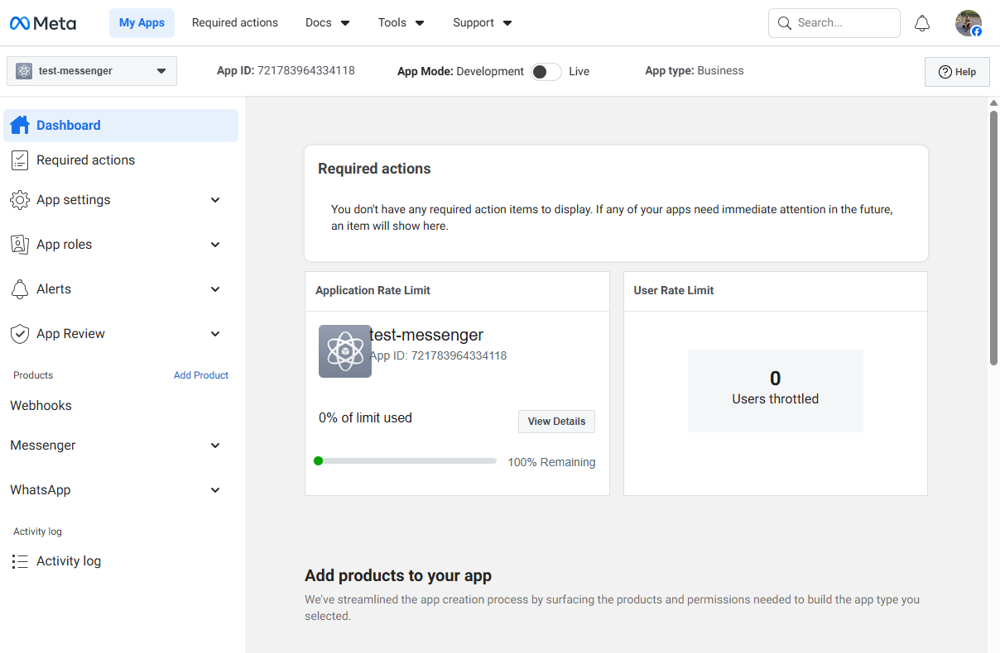
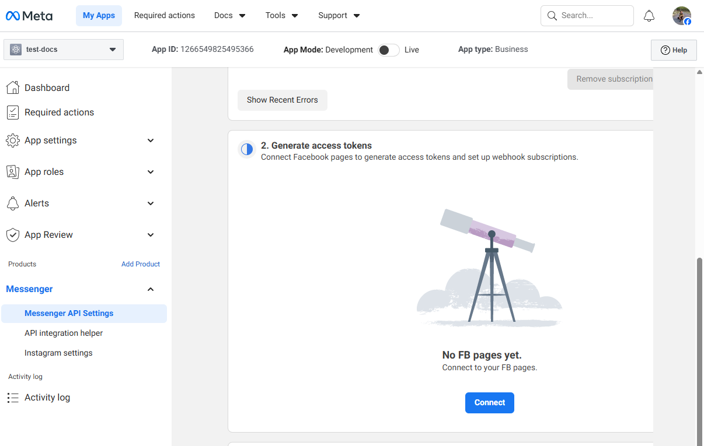
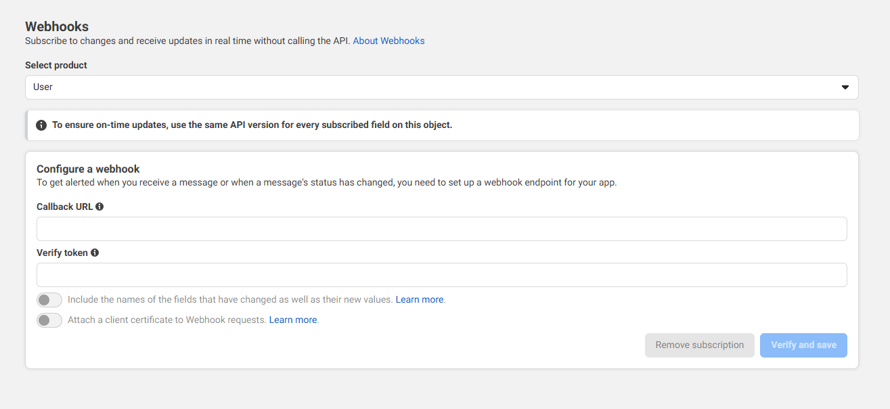
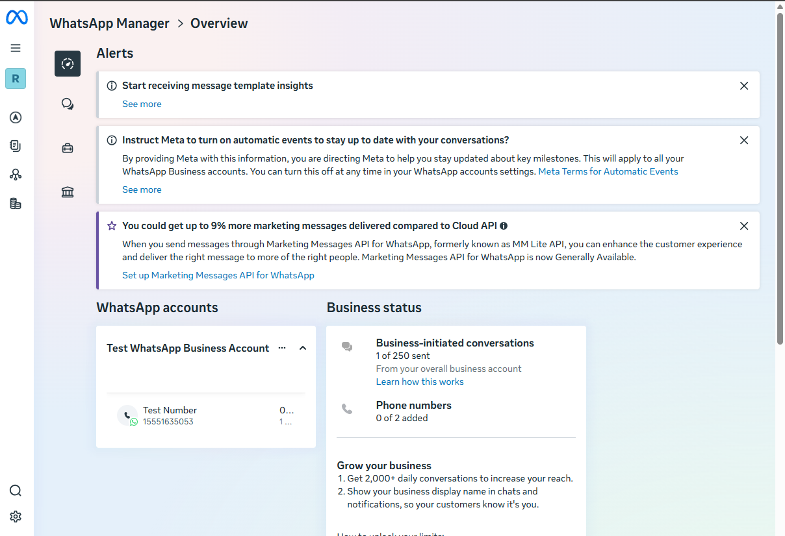
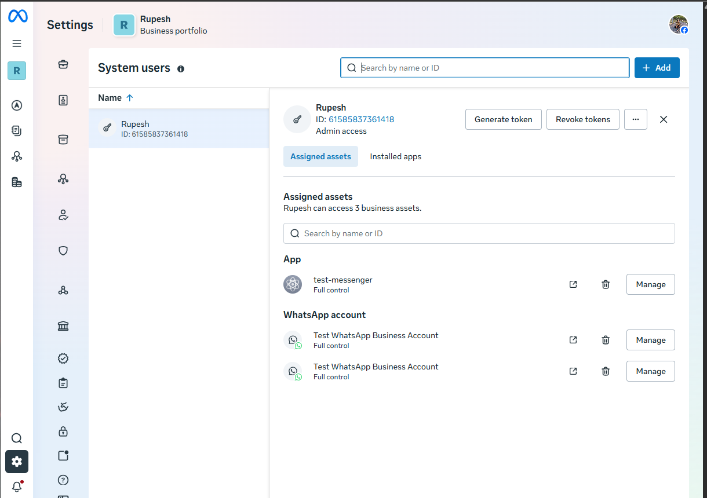
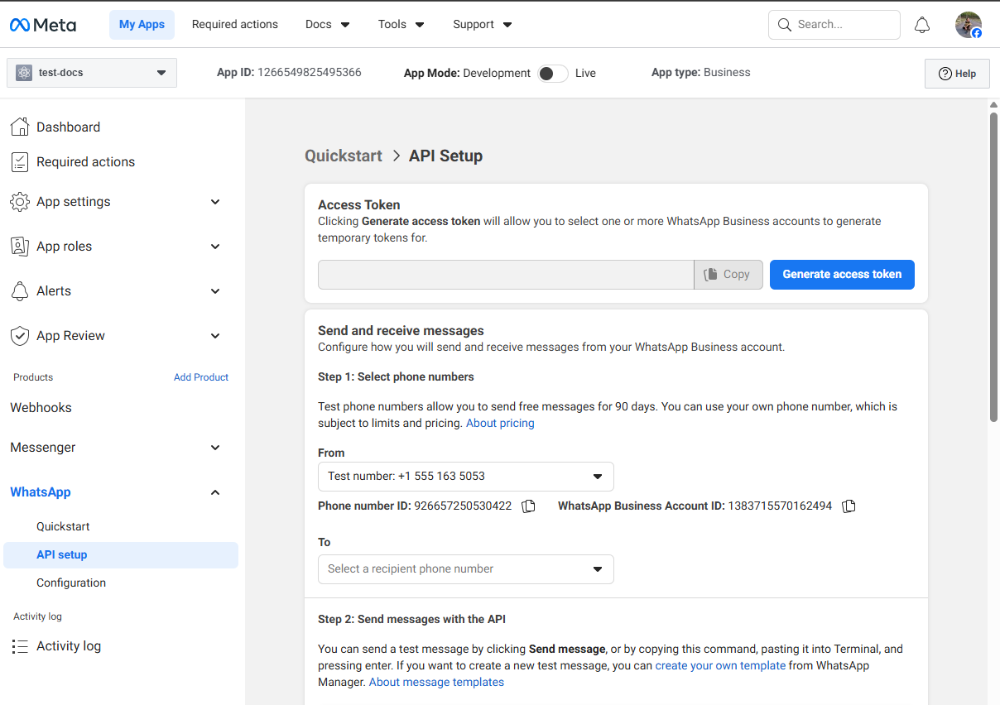
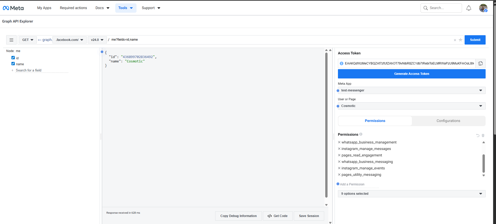

# Meta Messaging Integration (Messenger and WhatsApp)

This document explains how Messenger and WhatsApp were configured using **Meta Developers** and **Meta Business Suite**, including webhook setup, token generation, and local testing with ngrok.

## Overview

Meta integrations require **two separate dashboards** that work together:

1. **Meta Developers** – App, webhook, and product configuration  
2. **Meta Business Suite** – Business assets, permissions, system users, and tokens

Both are mandatory for Messenger and WhatsApp.

## Common Requirements

- Meta account
- Meta Business Account
- Public HTTPS URL (used via ngrok during development)
- Node.js backend with webhook endpoints

---

## Messenger Configuration

### 1. Create Meta App

- Go to **Meta Developers**
- Create a new app
- App type: *Business*
- Save **App ID** and **App Secret**



### 2. Add Messenger Product

- Inside the app → Add product → **Messenger**
- Now we will configure settings.

### 3. Page Connection

- Connect a **Facebook Page** to the app
- This page will send and receive messages



### 4. Webhook Setup

- Go to **Webhooks** in your dashboard. Click **Set Up**.
- Add webhook URL: (https://<ngrok-domain>/webhook/messenger) 
> During local development, **ngrok** is used to expose the local server with a public HTTPS URL so Meta can reach the webhook.
- Verify using the **verify token** defined in the backend 
- Subscribe to the following events:
    - messages
    - messaging_postbacks



> Once verified, Messenger events will be delivered to the backend webhook endpoint.

---

## WhatsApp Configuration

Unlike Messenger, WhatsApp onboarding starts from **Meta Business Suite** and is later linked to a **Meta App** for API access and webhook configuration. WhatsApp **cannot work without a Meta App**, even though most setup happens in Business Suite.

### 1. Create / Use Meta Business Account

- Go to **Meta Business Suite**
- Ensure a Business Account exists
- Make sure you have **Admin** access

### 2. Open WhatsApp Manager

- Go to Meta Business Suite → All tools → WhatsApp Manager
- On first access, Meta automatically:
  - Creates a **WhatsApp Business Account (WABA)**
  - Assigns a **temporary test phone number**

> The test number is used for initial API testing.
> A real phone number can be added later for production use.



### 3. Create System User

- Settings → Users → System Users

Steps:
- Create a system user
- Assign role: **Admin**
- Assign assets:
  - WhatsApp Account (WABA)
- Grant permissions:
  - `messaging`
  - `management`



### 4. Generate Access Token

- From the System User → **Generate token**
- Select the **Meta App**
- Select permissions:
  - `whatsapp_business_messaging`
  - `whatsapp_business_management`

### 5. Link WhatsApp to a Meta App (Required)

Even though WhatsApp assets (WABA, test number, tokens) are managed in
**Meta Business Suite**, a **Meta App is mandatory** for API and webhook integration.

Steps:
- Go to **Meta Developers**
- Create a **Business** app (if not already created)
- Add **WhatsApp** as a product
- Select the **same Business Account**
- Link the **WhatsApp Business Account (WABA)** to the app
- The linked WhatsApp Business Account and test phone number will be visible in the API setup.
- Add your personal phone number as a recipient for testing outbound messages.



### 6. Webhook Configuration (Meta App)

- In **Meta Developers**, open the app
- Go to **Webhooks**
- Subscribe to **WhatsApp** events
- Set webhook URL: https://<ngrok-domain>/webhook/whatsapp
- Verify using the backend verify token

## Local Development (ngrok)

Used to expose the local server publicly for Meta webhook verification.

```bash
ngrok http 3000
```

## Instagram Integration

### Instagram Access Tokens (Important)
Instagram Messaging APIs do not use a standalone Instagram access token. All Instagram Direct Message (DM) interactions are routed through a connected Facebook Page. To send and receive Instagram messages, your Instagram Business or Creator account must be linked to a Facebook Page, and your app must use a Facebook Page Access Token for that Page.

This Page Access Token must be generated with the required permissions (such as instagram_manage_messages, pages_utility_messaging, and instagram_basic) and is then used to call the Graph API endpoints (for example, POST /me/messages). In other words, Instagram messaging always flows through the Facebook Page layer, and using a Page Access Token linked to the Instagram Business account is the correct and expected approach—not a workaround or unnecessary complexity.

The tokens shown under “Instagram” in Meta Developer Dashboard usually will NOT work for Instagram Messaging. For sending/receiving Instagram DMs, you must use a Facebook Page Access Token



---


## Notes

### How the SDK works

A user imports the package, passes their credentials once, and their app is connected to the Meta platform. That's it.

```ts
import { WhatsAppSDK, FacebookMessengerSDK, InstagramSDK } from "noveltylab-platform-integrations";

const whatsapp = new WhatsAppSDK({
  accessToken: "EAAxxxx",
  phoneNumberId: "12345678",
});

// receive messages (in your webhook handler)
const result = await whatsapp.getWhatsAppMessage(req.body);

// send a message
await whatsapp.sendWhatsAppMessage({ to: "9779861976294", message: "Hello!" });
```

Without the SDK, every developer connecting to WhatsApp has to:

- Read Meta's API docs
- Figure out the right API endpoints and versions
- Write raw `fetch` calls with correct headers and auth
- Manually parse and validate webhook payloads
- Handle errors themselves
- Repeat all of this for Messenger and Instagram

**The SDK eliminates all of that.** The user just brings their credentials and their own business logic.

---

### On WhatsApp Templates (OTP, marketing, utility)

Templates are a **fundamentally different** sending mechanism from free-form text.

A regular text send is just `{ to, message }`. A template call requires a structured payload:

```ts
// what a template call to Meta's API actually needs
{
  messaging_product: "whatsapp",
  to: "9779861976294",
  type: "template",
  template: {
    name: "otp_code",
    language: { code: "en_US" },
    components: [
      { type: "body", parameters: [{ type: "text", text: "482910" }] }
    ]
  }
}
```

**`sendWhatsAppMessage` now handles both.** Pass `{ to, message }` for plain text. Pass `{ type: "template", to, template: { ... } }` for a template. The existing text usage stays completely untouched — nothing breaks.

---

### Concrete example — Building a WhatsApp OTP feature on top of the SDK

A developer wants to send OTP codes to users during signup. Here's all they need to write:

**1. Initialize**

```ts
import { WhatsAppSDK } from "noveltylab-platform-integrations";

const whatsapp = new WhatsAppSDK({
  accessToken: process.env.WHATSAPP_ACCESS_TOKEN,
  phoneNumberId: process.env.WHATSAPP_PHONE_NUMBER_ID,
});
```

**2. Build the OTP logic**

```ts
function generateOTP() {
  return Math.floor(100000 + Math.random() * 900000).toString();
}

async function sendOTP(phoneNumber: string) {
  const otp = generateOTP();

  // store in Redis with 5-minute expiry
  await redis.set(`otp:${phoneNumber}`, otp, "EX", 300);

  // SDK handles the Meta API call
  const result = await whatsapp.sendWhatsAppMessage({
    to: phoneNumber,
    message: `Your verification code is: ${otp}. Valid for 5 minutes.`,
  });

  if (!result.success) {
    throw new Error(`Failed to send OTP: ${result.error}`);
  }

  return { sent: true };
}
```

**3. Verify when the user submits the code**

```ts
async function verifyOTP(phoneNumber: string, code: string) {
  const stored = await redis.get(`otp:${phoneNumber}`);
  return stored === code;
}
```

The developer wrote **zero Meta API code** — no headers, no auth, no payload construction, no error parsing. The SDK handled all of it. They only wrote their business logic.

### WhatsApp template messages — before and after

#### Before

`sendWhatsAppMessage` only sent plain text:

```ts
// ONLY this was possible before
await whatsapp.sendWhatsAppMessage({
  to: "9779861976294",
  message: "Hello, your order is confirmed.",
});
```

#### Now

`sendWhatsAppMessage` detects the type and builds the correct API payload automatically:

```ts
// Text — still works exactly the same, nothing changed
await whatsapp.sendWhatsAppMessage({
  to: "9779861976294",
  message: "Hello!",
});

// Template — new
await whatsapp.sendWhatsAppMessage({
  type: "template",
  to: "9779861976294",
  template: {
    name: "otp_code",           // template name created and approved in Meta Business Suite
    language: { code: "en_US" },
    components: [
      { type: "body", parameters: [{ type: "text", text: "482910" }] },
    ],
  },
});
```

---

### OTP feature using template

```ts
const whatsapp = new WhatsAppSDK({
  accessToken: process.env.WHATSAPP_ACCESS_TOKEN,
  phoneNumberId: process.env.WHATSAPP_PHONE_NUMBER_ID,
});

async function sendOTP(phoneNumber: string, otp: string) {
  const result = await whatsapp.sendWhatsAppMessage({
    type: "template",
    to: phoneNumber,
    template: {
      name: "otp_code",           // must match exactly what's approved in Meta Business Suite
      language: { code: "en_US" },
      components: [
        {
          type: "body",
          parameters: [
            { type: "text", text: otp },  // fills the {{1}} variable in the template
          ],
        },
      ],
    },
  });

  if (!result.success) {
    console.error("Failed to send OTP:", result.error);
  }
}
```

> `name: "otp_code"` must match a template the business owner created and got approved inside **Meta Business Suite**. Once approved, this code sends it. The SDK handles auth, endpoint, payload structure, and error handling.
